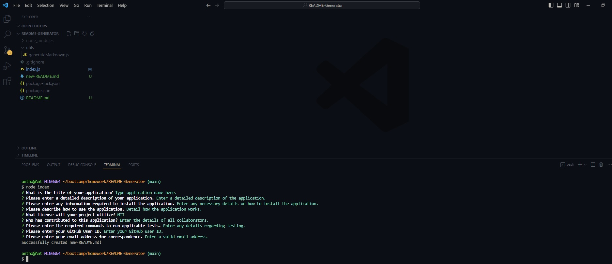

# <README-Generator>

## Description

README-Generator: https://github.com/Ant-M84/README-Generator

This application well help a user to generate a professional README.md document by answering several prompts to gain the required information to populate and generate a README file.

## Table of Contents (Optional)

If your README is long, add a table of contents to make it easy for users to find what they need.

- [Installation](#installation)
- [Usage](#usage)
- [Credits](#credits)
- [License](#license)

## Installation

Clone the repository from the URL link in the description to a local repository.

To initialize the application, run the command 'npm i' in the integrated terminal from the root directory to install the required packages.

## Usage

To use the application:

1. Open the 'index.js' file from within the integrated terminal.
2. Type 'node index' to run the program.
3. You will be prompted to answer numerous questions regarding the content of your README file as well as selecting a license type.
4. Upon successfully entering the required data, the message 'Successfully created new-README.md!' will display in the terminal and the 'new-README.md' will be generated.
5. Copy, paste and rename 'new-README.md' in the relevant repository as required.

